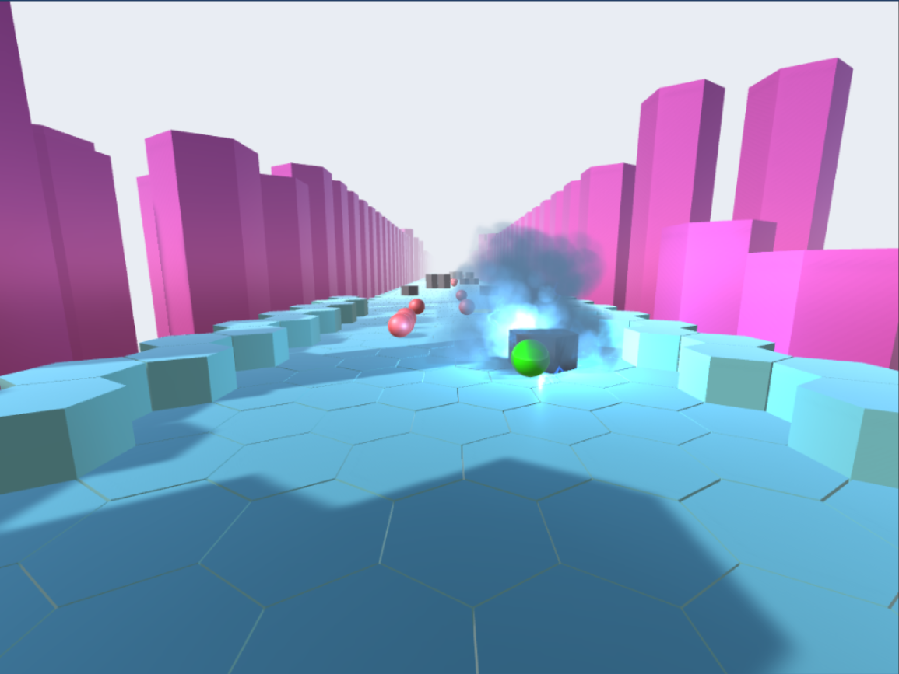

# BallsRaceGame  


This repo contains an educational implementation of a 3D Graphics Project using Unity3D. The goal of it was to create a simple single-player ball race game, where users could compete against computer-controlled opponents.




### Dependencies 
* [Blender - version 2.78](https://download.blender.org/release/Blender2.78/)
* [Unity Hub 2.2.1](https://public-cdn.cloud.unity3d.com/hub/prod/UnityHubSetup.exe) or later
* [Unity 2018.1.3f1](unityhub://2018.1.3f1/a53ad04f7c7f)

## Usage
### Import and Run
1) Download [Blender - version 2.78](https://download.blender.org/release/Blender2.78/), install it, and make sure that .blend files open with that.
2) Download [Unity Hub 2.2.1](https://public-cdn.cloud.unity3d.com/hub/prod/UnityHubSetup.exe) or later.
3) Sign up/in to [Unity Hub 2.2.1](https://public-cdn.cloud.unity3d.com/hub/prod/UnityHubSetup.exe).
4) From the Instal tab on [Unity Hub 2.2.1](https://public-cdn.cloud.unity3d.com/hub/prod/UnityHubSetup.exe), visit archive versions to download & install [Unity 2018.1.3f1](unityhub://2018.1.3f1/a53ad04f7c7f).
5) Download and unzip this repository from GitHub or just run on your Git client: 
   ```
   git clone https://github.com/CSpyridakis/BallsRaceGame.git
   ```
6) Run Unity, choose open an existing project, select this [folder](BallsRaceGame3D/) from this repo, and open it.
7) To select the scene: `File > Open Scene > Scenes > Game1 > Open`
8) You have to be able to make changes or/and play the game.

### Play already exported game 
Download [BallsRaceGame3D-Exported-Game.zip](https://github.com/CSpyridakis/BallsRaceGame/releases/download/V1.0/BallsRaceGame3D-Exported-Game.zip) from the latest release on a Windows machine, unzip it, and run the Build file to play.
